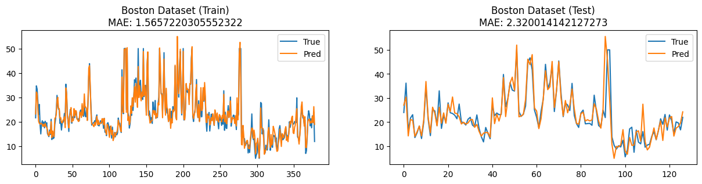

# MyTorch

**[Velog : [딥러닝] 경사하강법 구현부터 학습까지](https://velog.io/@pre_f_86/series/%EB%94%A5%EB%9F%AC%EB%8B%9D-%EA%B2%BD%EC%82%AC%ED%95%98%EA%B0%95%EB%B2%95-%EA%B5%AC%ED%98%84%EB%B6%80%ED%84%B0-%ED%95%99%EC%8A%B5%EA%B9%8C%EC%A7%80)**

**[Velog : [PyTorch] AutoGrad란 무엇인가?](https://velog.io/@pre_f_86/series/PyTorch-AutoGrad%EB%9E%80-%EB%AC%B4%EC%97%87%EC%9D%B8%EA%B0%80)**

최근 'SKT FLY AI'에서 공부하며 순전파와 역전파에 대해 강의를 들으며 갑자기 **'순전파 역전파를 전개해본적이 있던가?'** 라는 생각이 들어 계산해보려 하니 간단한 레이어 조차 계산하지 못하였습니다.

과거에도 [PyTorch 독립 레이어 만들기(Grad 끊기)](https://velog.io/@pre_f_86/PyTorch-%EB%8F%85%EB%A6%BD-%EB%A0%88%EC%9D%B4%EC%96%B4-%EB%A7%8C%EB%93%A4%EA%B8%B0Grad-%EB%81%8A%EA%B8%B0) 글을 작성하면서도 코드로 실험을 하며 알았지 정확히 왜 레이어가 단절되는지에 대해서는 정확히 몰랐던 거 같습니다.

경사하강법에 대해 이해하고 그래디언트의 흐름을 파악하는 것이 주요 목표이며, 외부 프레임워크를 최대한 쓰지 않고 직접 순전파 역전파를 구현하고 학습까지 진행하고자 한 프로젝트입니다.

# Todo

- [x] Optimize the code of the Operation method in parameter.py
- [x] Implements the array manipulation operation(ones, zeros etc...)
- [x] Implements the convolution layer
- [x] Implements the Non-Linear functions
- [ ] Fix inplace operation (Set Method)
- [x] Train/inference with real dataset([Boston](http://lib.stat.cmu.edu/datasets/boston), [MNIST](https://yann.lecun.com/exdb/mnist/), etc.)
- [ ] Optimize the speed of convolution operation
- [ ] Implements custom array object

## Result

- Boston 
    
    


# Tutorial

1. MyTorch Clone

    ```bash
    git clone https://github.com/PreFKim/MyTorch.git
    pip install numpy matplotlib
    cd MyTorch
    ```

2. 사용할 라이브러리 Import

    ```python
    import numpy as np
    import src as my
    import matplotlib.pyplot as plt
    from dataset import *
    ```

3. 학습에 사용할 데이터셋 준비

    ```python
    x, y = boston()
    print(x.shape, y.shape)

    # Split
    train_idx = []
    test_idx =[]
    for i in range(len(x)):
        if i%4!=0:
            train_idx.append(i)
        else:
            test_idx.append(i)

    train_x = x[train_idx]
    train_y = y[train_idx, np.newaxis]
    test_x = x[test_idx]
    test_y = y[test_idx, np.newaxis]

    # Noramlize
    min_val_x, max_val_x = train_x.min(0), train_x.max(0)
    min_val_y, max_val_y = train_y.min(0), train_y.max(0)

    train_x = (train_x-min_val_x)/(max_val_x-min_val_x)
    test_x = (test_x-min_val_x)/(max_val_x-min_val_x)

    train_y = (train_y-min_val_y)/(max_val_y-min_val_y)

    # Wrap with Param object
    train_x = my.Param(train_x)
    train_y = my.Param(train_y)
    test_x = my.Param(test_x)
    test_y = my.Param(test_y)
    train_x.shape, train_y.shape, test_x.shape, test_y.shape

    ```

4. 모델 학습 파이프라인 작성 (Pytorch와 유사한 구조)

    ```python
    class Model(my.layers.Module):
        def __init__(self):
            self.l1 = my.layers.Linear(13, 32)
            self.l2 = my.layers.Linear(32, 32)
            self.l3 = my.layers.Linear(32, 32)
            self.l4 = my.layers.Linear(32, 1)

            self.activation = my.layers.ReLU()

        def forward(self,x):
            out = self.l1(x)
            out = self.activation(out)
            out = self.l2(out)
            out = self.activation(out)
            out = self.l3(out)
            out = self.activation(out)
            out = self.l4(out)
            return out

    model = Model()
    optim = my.optimizers.Adam(model.parameters(), lr=1e-3)

    for i in range(1000):
        pred = model(train_x)
        loss = ((pred - train_y)**2).mean()
        loss.backward()
        optim.step()
        optim.zero_grad()
    print(loss)
    ```     

5. 평가 및 시각화

    ```python
    pred_y = model(train_x)
    pred_y = pred_y*(max_val_y-min_val_y)+(min_val_y)
    orig_train_y = train_y*(max_val_y-min_val_y)+(min_val_y)
    train_mae = (abs(pred_y-orig_train_y).mean()).data
    plt.figure(figsize=(15, 3))
    plt.subplot(1, 2, 1)
    plt.title(f"Boston Dataset (Train)\nMAE: {train_mae}")
    plt.plot(orig_train_y.data, label="True")
    plt.plot(pred_y.data, label="Pred")
    plt.legend()

    pred_y = model(test_x)
    pred_y = pred_y*(max_val_y-min_val_y)+(min_val_y)
    test_mae = (abs(pred_y-test_y).mean()).data

    plt.subplot(1, 2, 2)
    plt.title(f"Boston Dataset (Test)\nMAE: {test_mae}")
    plt.plot(test_y.data, label="True")
    plt.plot(pred_y.data, label="Pred")
    plt.legend()
    plt.show()
    ```
