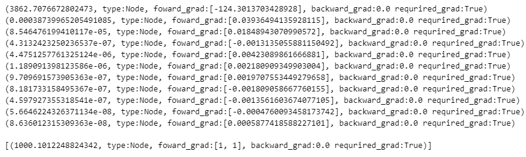

# MyTorch (2023-08-21 ~ 2023-10-02)

**[Velog : [딥러닝] 경사하강법 구현부터 학습까지(1)](https://velog.io/@pre_f_86/%EB%94%A5%EB%9F%AC%EB%8B%9D-%EA%B2%BD%EC%82%AC%ED%95%98%EA%B0%95%EB%B2%95-%EA%B5%AC%ED%98%84%EB%B6%80%ED%84%B0-%ED%95%99%EC%8A%B5%EA%B9%8C%EC%A7%80-1)**

최근 'SKT FLY AI'에서 공부하며 순전파와 역전파에 대해 강의를 들으며 갑자기 **'순전파 역전파를 전개해본적이 있던가?'** 라는 생각이 들어 계산해보려 하니 간단한 레이어 조차 계산하지 못하였습니다.

과거에도 PyTorch 독립 레이어 만들기(Grad 끊기) 글을 작성하면서도 코드로 실험을 하며 알았지 정확히 왜 레이어가 단절되는지에 대해서는 정확히 몰랐던 거 같습니다.

경사하강법을 이해하고 순전파와 역전파를 통한 파라미터 학습까지 진행하여 Gradient의 흐름을 이해하고자 진행한 프로젝트입니다.

## How to Use

1. 깃허브를 clone한다.

    git clone https://github.com/PreFKim/MyTorch.git

2. clone한 디렉토리로 이동하여 src를 import해준다.

```python
import src as my
```

3. 원하는 구조에 맞게 모델을 수정한다.(PyTorch와 형식은 비슷합니다.)

    **※ 입출력 데이터는 list 형식을 따릅니다.**

```python
def relu(x):
    ret = []
    for p in x:
        if p.data>0 : ret.append(p)
        else : ret.append(my.Param(0))
    return ret


class model(my.layers.Module):
    def __init__(self):
        self.l1 = my.layers.Linear(2,4)
        self.l2 = my.layers.Linear(4,4)
        self.l3 = my.layers.Linear(4,4)
        self.l4 = my.layers.Linear(4,1)

    def forward(self,x):
        out = self.l1(x)
        out = relu(out)
        out = self.l2(out)
        out = relu(out)
        out = self.l3(out)
        out = relu(out)
        out = self.l4(out)
        return out
```

4. Optimizer와 학습 코드를 작성한다.

```python
model = mymodel()
optimizers = my.optimizers.Adam(params=model.parameters(),lr=1e-3)

for i in range(100):
    for j in range(100):

        x = [j,j]
        out = model(x)
        loss = (out[0]-j)**2
        loss.backward()
        optimizers.update()
        optimizers.zero_grad()
    if (i%10==0):
        print(loss)  
print(loss)
model([1000,1000])
```

### Result



## Directory
    MyTorch
        │  .gitignore
        │  README.md
        │  test.ipynb       # 구현 실험 코드
        │  __init__.py
        │
        └─src
            │  parameter.py # Parameter 코드
            │  ...
            │
            ├─layers        # Layer 코드
            │  module.py    # Layer Module 코드
            │  ...
            │
            └─optimizers    # Optimizer 코드
                ...